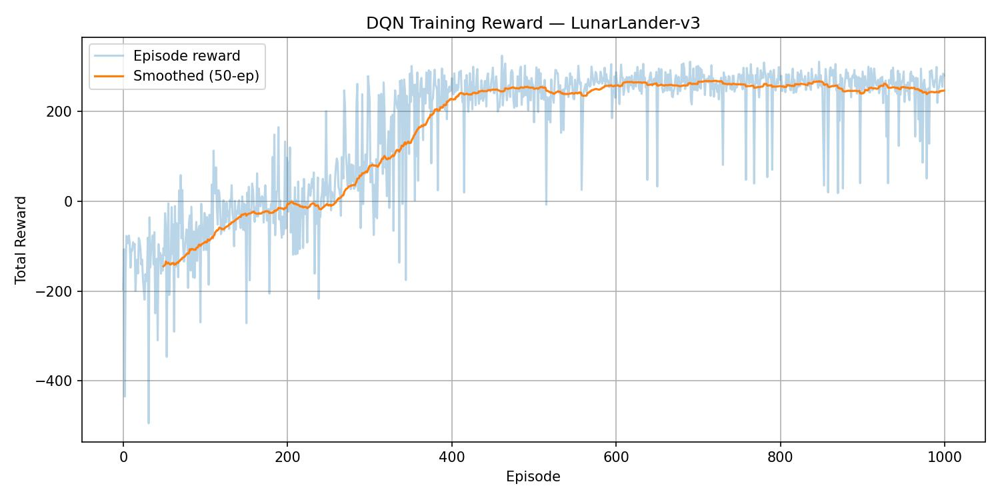
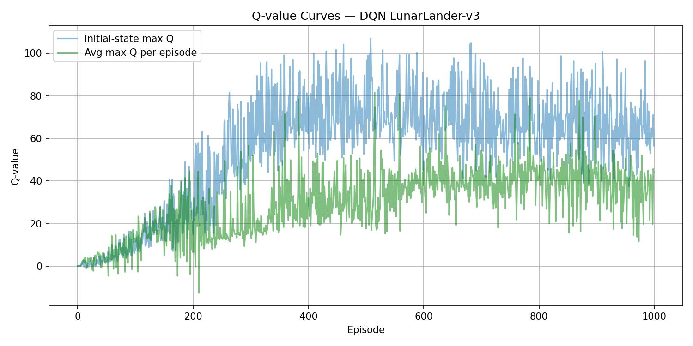
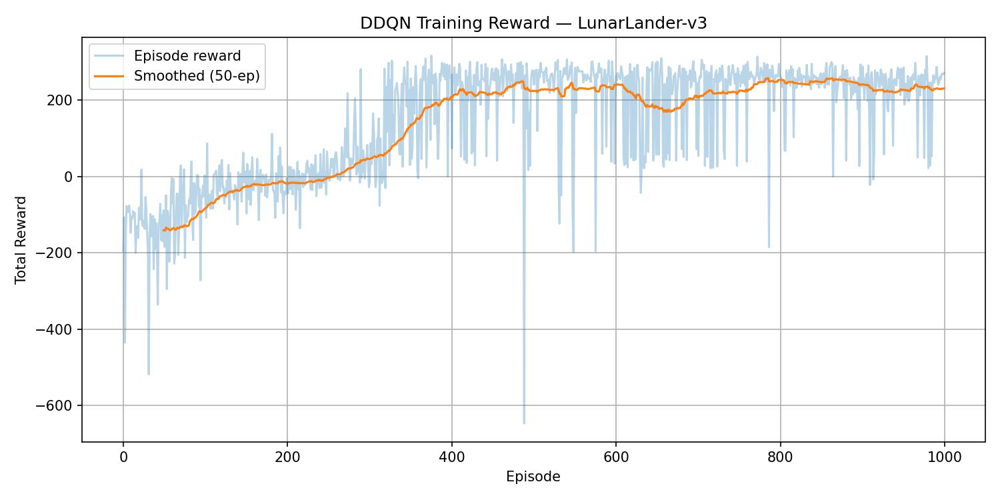
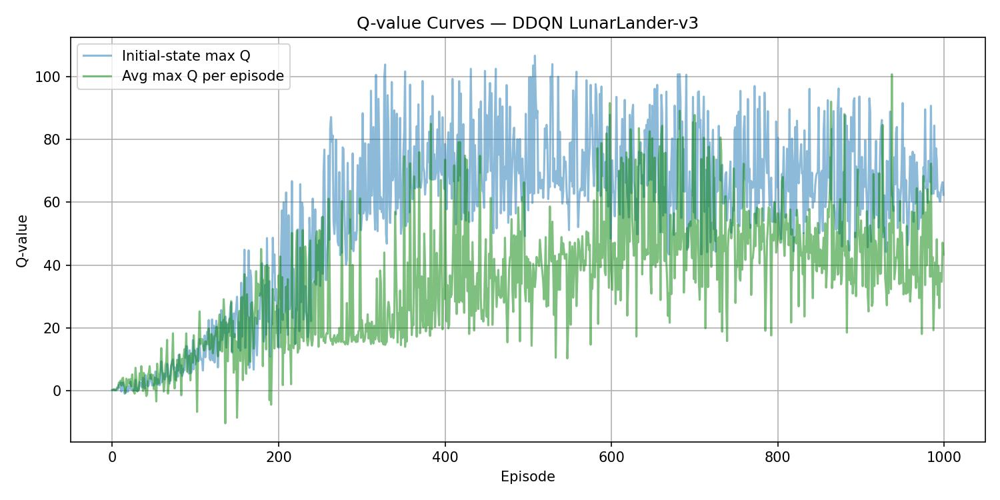

\newpage

# Environment & Problem Setting

**LunarLander-v3** is a continuous-state, discrete-action control task in the Gymnasium library. The goal is to land the lunar module safely on the pad between the two flags.

**State space** (8-dimensional, continuous):

- Horizontal and vertical position ($x$, $y$)
- Horizontal and vertical velocity ($\dot{x}$, $\dot{y}$)
- Lander angle $\theta$ and angular velocity $\dot{\theta}$
- Two binary leg contact indicators (left, right)

**Action space** (4 discrete actions):

| Action | Description       |
| :----: | :---------------- |
|   0    | Do nothing        |
|   1    | Fire left engine  |
|   2    | Fire main engine  |
|   3    | Fire right engine |

**Reward structure.** The environment uses shaped rewards to guide learning. A successful landing gives about +100--140, crashing gives $-100$, each leg contact gives $+10$, and using the main engine costs $-0.3$ per frame. The task is considered _solved_ when the cumulative reward is above 200.

Since the state space is continuous and fairly high-dimensional, tabular methods such as Q-learning are not practical here. Instead, a neural network is used to approximate the Q-function.

# DQN Method

Deep Q-Network (DQN) extends Q-learning to continuous state spaces by replacing the Q-table with a neural network $Q(s, a;\, \theta)$. In this implementation, training is stabilized by three standard components.

**Neural network Q-function.**  
A two-layer MLP with ReLU activations is used:
$$\text{Input}(8) \;\to\; \text{FC}(128) \;\to\; \text{FC}(128) \;\to\; \text{Output}(4).$$
The network outputs one Q-value for each action, and the value of the selected action is updated toward the Bellman target using Huber (SmoothL1) loss.

**Experience replay.**  
Transitions $(s, a, r, s', \textit{done})$ are stored in a circular replay buffer with capacity 100,000. During training, a mini-batch of 64 transitions is sampled uniformly at each update step. This helps reduce the correlation between consecutive samples and improves sample efficiency.

**Target network.**  
A separate target network with parameters $\theta^-$ is used to compute stable regression targets:
$$y = r + \gamma \cdot \max_{a'} Q(s', a';\, \theta^-).$$
The target network is updated by copying the online network every 1,000 gradient steps. Without this, the target changes too quickly and training can become unstable.

**$\varepsilon$-greedy exploration.**  
The agent follows an $\varepsilon$-greedy policy. It chooses a random action with probability $\varepsilon$, which decays multiplicatively from $\varepsilon_0 = 1.0$ to $\varepsilon_{\min} = 0.01$ using a factor of $\times 0.995$ per episode. This allows more exploration at the beginning and gradually shifts the policy toward greedy action selection.

# DDQN Method

A known issue in standard DQN is that it can overestimate Q-values, because the same network is used for both action _selection_ and action _evaluation_. Double DQN (DDQN) reduces this problem by separating these two roles.

| Algorithm | TD Target                                                                                  |
| :-------- | :----------------------------------------------------------------------------------------- |
| DQN       | $r + \gamma \cdot \max_{a'} Q_{\text{tgt}}(s', a')$                                        |
| DDQN      | $r + \gamma \cdot Q_{\text{tgt}}\!\left(s',\; \arg\max_{a'} Q_{\text{onl}}(s', a')\right)$ |

In DDQN, the _online_ network chooses the greedy action, while the _target_ network evaluates that action. In practice, this gives more conservative and usually more reliable value estimates. The nice part is that DDQN only changes the target computation, so the rest of the implementation stays the same.

\newpage

# Implementation Details & Hyperparameters

Table \ref{tab:hyper} lists the hyperparameters used in both Task 1 (DQN) and Task 2 (DDQN). The settings are the same except for the target computation formula.

| Parameter                           | Value                                           |
| :---------------------------------- | :---------------------------------------------- |
| Environment                         | LunarLander-v3                                  |
| Training episodes                   | 1,000                                           |
| Optimizer                           | Adam                                            |
| Learning rate $\alpha$              | $1 \times 10^{-4}$                              |
| Discount factor $\gamma$            | 0.99                                            |
| Replay buffer capacity              | 100,000                                         |
| Mini-batch size                     | 64                                              |
| $\varepsilon$ (start / end / decay) | 1.0 / 0.01 / $\times$0.995 per episode          |
| Target network update               | Hard copy every 1,000 steps                     |
| Network architecture                | FC(128)--ReLU--FC(128)--ReLU, input 8, output 4 |
| Loss function                       | Huber (SmoothL1)                                |
| Gradient clipping                   | $\ell_2$ norm $\leq 10$                         |
| Random seed                         | 42                                              |

Table: Hyperparameters used for both DQN and DDQN. \label{tab:hyper}

\newpage

# Training Results

## Task 1 --- DQN

From the reward curve, the smoothed return becomes positive at around episode 200, reaches about 230 near episode 400, and then stays above 240 for the rest of training. The final 50-episode average reward is $\approx 247$, which is comfortably above the solve threshold of 200.

Both Q-value curves increase over time, which matches the improvement in policy quality. The initial-state max Q (blue) stays higher than the per-episode average (green). One possible reason is that the initial state is relatively favorable: the lander starts at a reasonable altitude with full fuel, so the estimated return from that state is higher.

## Task 2 --- DDQN

DDQN shows a very similar learning trend. The smoothed reward passes 200 at around episode 420 and the final 50-episode average is $\approx 231$. There is somewhat higher variance in the middle part of training, especially around episodes 500--700, but the method still converges.

Compared with DQN, the DDQN Q-value curves grow a bit more steadily and show less episode-to-episode fluctuation. This matches the idea that DDQN reduces overestimation bias. The two curves are also closer to each other, which suggests that the value estimates are more consistent across the trajectory.

\newpage

# DQN vs. DDQN Comparison

| Metric                                   |      DQN      |     DDQN      |
| :--------------------------------------- | :-----------: | :-----------: |
| Final avg. reward (last 50 ep.)          | $\approx 247$ | $\approx 231$ |
| Greedy test episode reward               | $\approx 241$ | $\approx 293$ |
| Episodes to first reach reward $\ge 200$ | $\approx 400$ | $\approx 420$ |
| Peak Q-value (initial state)             | $\approx 100$ | $\approx 100$ |

Table: Side-by-side comparison of DQN and DDQN on LunarLander-v3.

Both methods solve the environment successfully. DQN converges a little faster and has a slightly higher average reward during training, while DDQN gets the better greedy test score ($\approx 293$ vs. $\approx 241$). One possible explanation is the usual overestimation effect in DQN: during training, larger Q-values can make the policy look better than it really is, but once exploration is removed, the greedy policy may not be as strong as the training curve suggests. DDQN gives more conservative estimates, which seems to help test-time performance here.

The Q-value plots support this interpretation. DDQN keeps the value estimates smoother and slightly more controlled in magnitude. In tasks with larger action spaces or sparser rewards, where overestimation matters more, the gap between DDQN and DQN would likely be more obvious.

# Conclusion

Both DQN and DDQN are able to solve LunarLander-v3 within 1,000 episodes on CPU. A few main observations from this homework are listed below:

- **Experience replay and a target network** are important for stable training. Without them, updates become too correlated and the target changes too quickly.
- **The DDQN change is small but useful**. Only the target computation is modified, but this is enough to reduce overestimation bias and improve greedy test performance without extra hyperparameter tuning.
- **The chosen hyperparameters work reasonably well** for both methods. A linear $\varepsilon$-decay schedule or prioritized replay could be possible directions for improving sample efficiency.
- **The most unstable stage is the early training phase**. Rewards stay below $-200$ during roughly the first 100--200 episodes, before the replay buffer becomes more diverse and $\varepsilon$ decreases enough to reduce random behavior.
