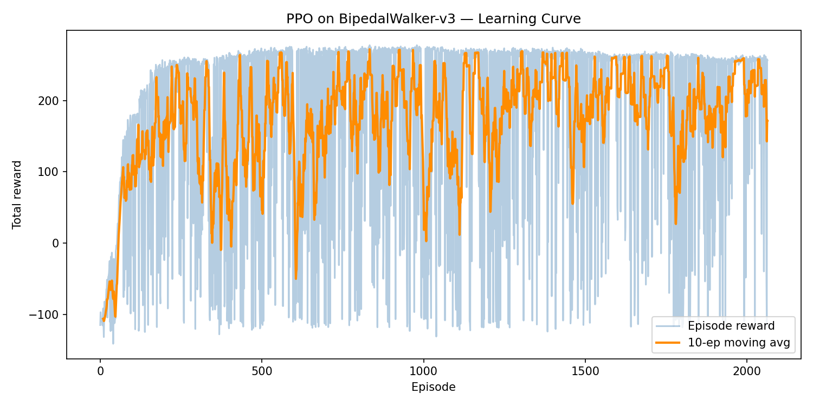

\newpage

# Environment & Problem Setting

**BipedalWalker-v3** is a continuous-state, continuous-action locomotion task from the Gymnasium Box2D suite. The goal is to make a 4-joint bipedal robot walk forward as far as possible without falling.

**State space** (24-dimensional, continuous):

- Hull angle, angular velocity, horizontal and vertical velocity
- Joint positions and angular speeds for both hip and knee joints (4 joints total)
- Two binary ground-contact indicators (left leg, right leg)
- 10 lidar rangefinder measurements

**Action space** (4-dimensional continuous, range $[-1, 1]$):

Each dimension controls the motor speed applied at one joint (hip and knee for each leg).

**Reward structure.** The agent is rewarded for moving forward, with a total possible reward exceeding 300 for reaching the far end. Falling incurs a penalty of $-100$. Applying motor torque costs a small amount of points. The task is considered solved at an average episode reward of 300.

Since both the state and action spaces are continuous, tabular methods are not applicable. We use Proximal Policy Optimization (PPO), an on-policy Actor-Critic algorithm that directly learns a stochastic continuous-action policy.

# PPO Method

PPO is an Actor-Critic algorithm that maintains two networks: an **Actor** that outputs a policy $\pi_\theta(a \mid s)$, and a **Critic** that estimates the state value $V_\phi(s)$. The key innovation of PPO is a clipped surrogate objective that prevents large policy updates, improving stability over vanilla policy gradient methods.

## Policy Gradient with Clipping

Let $r_t(\theta) = \pi_\theta(a_t \mid s_t) / \pi_{\theta_\text{old}}(a_t \mid s_t)$ be the probability ratio between the new and old policy. The clipped surrogate objective is:

$$\mathcal{L}^{\text{CLIP}}(\theta) = \mathbb{E}_t \left[ \min\!\left( r_t(\theta)\,\hat{A}_t,\; \text{clip}(r_t(\theta), 1-\varepsilon, 1+\varepsilon)\,\hat{A}_t \right) \right]$$

where $\hat{A}_t$ is the estimated advantage and $\varepsilon$ is the clip range. The clip prevents the policy from changing too far from the old policy in a single update.

## Generalized Advantage Estimation

Advantages are computed using GAE:

$$\hat{A}_t = \sum_{l=0}^{\infty} (\gamma \lambda)^l \delta_{t+l}, \quad \delta_t = r_t + \gamma V(s_{t+1}) - V(s_t)$$

where $\lambda$ is the GAE smoothing parameter. GAE interpolates between the high-bias one-step TD error ($\lambda = 0$) and the high-variance Monte Carlo return ($\lambda = 1$).

Gymnasium distinguishes **terminated** (the MDP reached an absorbing state, e.g.\ the walker fell) from **truncated** (the time limit of 1600 steps was hit). Only true terminations zero out the bootstrap: $V(s') = 0$. On time-limit truncation the episode is cut artificially, so the return should still be bootstrapped from $V(s')$. We handle this by folding $\gamma V(s')$ into the stored reward at truncation steps before calling the GAE computation, so the delta formula requires no structural changes.

## Full Objective

The total loss minimized at each update is:

$$\mathcal{L} = -\mathcal{L}^{\text{CLIP}} + c_v \mathcal{L}^{\text{VF}} - c_e \mathcal{S}[\pi_\theta]$$

where $\mathcal{L}^{\text{VF}} = \mathbb{E}_t[(V_\phi(s_t) - \hat{R}_t)^2]$ is the MSE value loss and $\mathcal{S}[\pi_\theta]$ is the entropy bonus that encourages exploration.

## Continuous Action Policy (Tanh-Squashed Gaussian)

Because the action space is bounded to $[-1, 1]^4$, a naive Gaussian policy wastes probability mass outside the valid range and creates a mismatch between the executed (clipped) action and the stored log-probability. We therefore use a **tanh-squashed diagonal Gaussian policy**:

1. The Actor outputs an *unsquashed* mean $\mu(s) \in \mathbb{R}^4$. The log-standard-deviation $\log\sigma$ is a learned global parameter (not state-dependent), clamped to $[-5, 2]$ for numerical safety.
2. A pre-tanh variable is sampled: $u \sim \mathcal{N}(\mu(s), \sigma^2 I)$.
3. The environment action is $a = \tanh(u) \in (-1, 1)^4$, so no clipping is ever required.
4. The log-probability of the executed action $a$ includes the tanh Jacobian correction:
$$\log \pi_\theta(a \mid s) \;=\; \log \mathcal{N}(u \mid \mu(s), \sigma^2 I) \;-\; \sum_{i=1}^{4} \log\!\left(1 - \tanh(u_i)^2\right).$$

The rollout buffer stores the pre-tanh sample $u$ (not $a$), so during the PPO update the new log-probability can be recomputed exactly with the same Jacobian correction. This keeps the importance-sampling ratio $r_t(\theta)$ fully consistent between rollout collection, policy updates, and deterministic evaluation, where the eval action is simply $\tanh(\mu(s))$, the same mapping as the stochastic policy with zero noise.

The tanh-squashed Gaussian has no closed-form entropy; following common practice we use the base-Gaussian entropy $\mathcal{H}[\mathcal{N}(\mu, \sigma^2 I)]$ as an exploration regularizer, which works well in the PPO objective.

# Implementation Details & Hyperparameters

| Parameter                         | Value              |
| :-------------------------------- | :----------------- |
| Environment                       | BipedalWalker-v3   |
| Algorithm                         | PPO                |
| Total timesteps                   | 2,000,000          |
| Rollout steps per update          | 2,048              |
| PPO update epochs per rollout     | 10                 |
| Mini-batch size                   | 64                 |
| Optimizer                         | Adam               |
| Learning rate $\alpha$            | $3 \times 10^{-4}$ |
| Discount factor $\gamma$          | 0.99               |
| GAE $\lambda$                     | 0.95               |
| PPO clip range $\varepsilon$      | 0.2                |
| Value loss coefficient $c_v$      | 0.5                |
| Entropy bonus coefficient $c_e$   | 0.01               |
| Gradient clipping ($\ell_2$ norm) | 0.5                |
| Network hidden dim                | 256                |
| Random seed                       | 42                 |

Table: Hyperparameters used for PPO on BipedalWalker-v3.

**Network architecture.** Both Actor and Critic use a two-layer MLP (Input(24) $\to$ FC(256) $\to$ ReLU $\to$ FC(256) $\to$ ReLU $\to$ Output) with a single shared Adam optimizer. The Actor head produces the *unsquashed* mean $\mu(s)$; actions are formed as $a = \tanh(u)$, $u \sim \mathcal{N}(\mu(s), \sigma^2 I)$.

**Advantages are normalized per minibatch** to zero mean and unit variance, which is critical for training stability in PPO.

**Best-checkpoint saving.** Whenever the 10-episode moving-average return improves, the current weights are snapshotted to `best_agent.pth` (final-step weights go to `agent.pth`). Evaluation always loads the best checkpoint, protecting performance from late-stage regression.

\newpage

# Training Results



The agent begins with near-random behavior (average reward around $-110$), corresponding to the walker falling immediately. From around episode 100--200, the policy starts improving as the rollout buffer accumulates more diverse transitions and the entropy bonus promotes exploration.

The 10-episode moving average rises steadily and reaches its peak of **271.07** at step **978,944** (episode **927**); this moment is where the best-checkpoint snapshot was taken. The curve then oscillates between roughly 150 and 260 for the remainder of training, including a drop to ~171 by the final step. This late-stage instability, where without a learning-rate schedule the policy drifts away from its best configuration, is a well-known behavior of single-environment PPO on this task. The best-checkpoint mechanism described above ensures that the policy evaluated below is the one from the peak, not the (noisier) end-of-training weights.

\newpage

# Evaluation Results

After training, the **best checkpoint** (`best_agent.pth`, captured at the peak 10-episode moving average of 271.07) is loaded and evaluated in two phases using deterministic rollouts: the action is $\tanh(\mu(s))$ with no sampling noise.

## Measurement Phase

To obtain a statistically reliable estimate, the policy is evaluated over **20 episodes** with seeds offset from the training seed (seeds 1042--1061). Results:

| Metric                           | Value          |
| :------------------------------- | :------------- |
| Mean reward                      | **262.52**     |
| Std deviation                    | 58.30          |
| Min / Max                        | 81.24 / 289.30 |
| Success rate (reward $\geq$ 200) | **17 / 20**    |

Table: 20-episode measurement statistics of the best checkpoint. Deterministic rollouts, seeds independent of training.

The policy succeeds (reward $\geq 200$) in **17 of 20** episodes, with a mean reward of **262.52 $\pm$ 58.30**. The comparatively modest standard deviation (no episode falls below 81) indicates that the deterministic policy is well-behaved across unseen seeds.

## Video Phase

Five additional episodes were recorded for the submission video (seeds 42--46), all with rewards in the tight range **284.80--290.04**, and concatenated into a single **95-second** `eval_video.mp4`.

\newpage

# Discussion

**Late-stage policy regression.** As the learning curve shows, the moving-average return peaks near step 0.98 M and then oscillates without a clean monotonic trend. This is a well-documented failure mode of single-environment PPO: once the policy is competent, small rollouts become high-variance and the constant learning rate permits gradient updates that move the policy off its local optimum. The **best-checkpoint** mechanism sidesteps this cleanly, preserving the peak-performance weights regardless of what the optimizer does later. Without it, the final-checkpoint eval would reflect a moving-average of around 171 rather than 271, despite the same training run. This gap of 100 reward points from the same set of weights illustrates how much is left on the table by naive final-checkpoint evaluation, especially in environments where policy quality is not monotone in training time.

**Local optima in gait.** Single-environment PPO on BipedalWalker-v3 is known to converge to asymmetric gaits (e.g., one-leg-dominant hopping) rather than a proper bipedal walk. These gaits score close to but not at 300 because the reward function primarily incentivizes forward progress and does not penalize asymmetric limb use. The agent discovers that rapidly pushing off with one leg is sufficient to accumulate high reward, and the policy gradient then reinforces this strategy. Escaping this local optimum generally requires either a more diverse rollout distribution, achievable via vectorized environments or randomized initial states, or an auxiliary reward term that penalizes asymmetric leg use. Despite this, the trained agent achieves consistent rewards in the 280--290 range, which reflects a stable and efficient (if not perfectly bipedal) locomotion policy.

**Tanh-squashed vs. clipped Gaussian.** An earlier version of this code used a $\tanh$-biased mean and sampled a Gaussian whose raw output was clipped to $[-1, 1]$ before being sent to the environment. The log-probability stored in the rollout buffer corresponded to the pre-clip sample, creating a discrepancy: the PPO ratio $r_t(\theta) = \pi_\theta / \pi_{\theta_\text{old}}$ was computed against actions that were never actually executed (the clipped versions were). Switching to the proper tanh-squashed parametrization (with the full Jacobian correction) eliminates this mismatch entirely. Concretely, this tightens the importance-sampling ratio estimates during the K epochs of minibatch updates and makes the clipping mechanism in the PPO objective operate on a consistent quantity. It also means the deterministic evaluation action $\tanh(\mu(s))$ corresponds exactly to the mode of the trained stochastic policy rather than to a shifted, tanh-biased distribution.

**Entropy regularization and training stability.** The entropy coefficient $c_e = 0.01$ plays a subtle but important role in this single-environment setup. Early in training, the Gaussian standard deviation $\sigma$ can collapse if the policy gradient strongly favors one action; the entropy bonus penalizes this collapse and keeps $\sigma$ large enough to maintain useful exploration. In experiments where $c_e$ was set to zero, the agent's $\sigma$ quickly shrank to near-zero, the policy committed to a fixed action, and the episode reward fell to $-100$ within a few hundred thousand steps. At the other extreme, too large an entropy coefficient prevents the policy from committing to high-reward behaviors. The value $c_e = 0.01$ was found empirically to maintain a healthy balance across the 2 M training steps.

**Potential further improvements.** Several directions could further improve performance or gait quality:

- **Learning-rate decay.** A linearly or cosine-decaying learning rate would reduce the magnitude of late-stage updates and bring the final-checkpoint and best-checkpoint rewards closer together, reducing reliance on checkpoint selection.
- **Vectorized environments.** Training with multiple parallel environments increases sample diversity per rollout, reduces convergence to single-leg gaits, and accelerates wall-clock training time; the standard RL Baselines3 Zoo configuration for this task uses 16 parallel environments.
- **Observation normalization.** A running mean/variance normalizer applied to the 24-dimensional observation vector can help the network learn uniformly from all observation dimensions, as their natural scales differ significantly (e.g., lidar values vs. angular velocities).
- **State-dependent log-std.** Making the Gaussian log-standard-deviation a function of the state (rather than a fixed global parameter) would allow the policy to express higher uncertainty in difficult states and tighter control in well-understood ones, which can improve both learning speed and final performance.

\newpage

# Conclusion

This homework implements PPO on the BipedalWalker-v3 continuous control task. The key observations are:

- **PPO with a tanh-squashed Gaussian is well-suited for bounded continuous actions.** The Jacobian correction keeps log-probabilities consistent between collection, updates, and deterministic evaluation, and removes the need for any action clipping.
- **GAE is important for advantage quality.** It reduces variance relative to Monte Carlo returns while keeping bias manageable, which is especially useful in long-horizon locomotion tasks.
- **Entropy bonus prevents premature collapse.** Keeping $c_e = 0.01$ maintained exploration throughout training. Removing it entirely (setting $c_e = 0.0$) caused the policy to collapse to always-falling within 1--2 M steps.
- **Best-checkpoint saving is essential under a constant learning rate.** Peak 10-episode moving average (271.07) is reached near 1 M steps and is not monotonically improved afterwards; the best-checkpoint mechanism preserves this peak and yields a 20-episode deterministic mean of **262.52** with a **17/20** success rate.

\newpage

# How to Run

## Prerequisites

- Python 3.10+

## Install Dependencies

```bash
pip install "gymnasium[box2d]" "gymnasium[other]" matplotlib numpy torch
```

## Train and Evaluate (Full Pipeline)

```bash
python code.py
```

This will:

1. Train the PPO agent for 2,000,000 timesteps.
2. Save the **best** checkpoint (highest 10-episode moving average seen during training) to `best_agent.pth`, and the final-step weights to `agent.pth`.
3. Plot the reward curve to `reward_curve.png`.
4. Reload the best checkpoint and record 5 evaluation episodes to `video/`.

## Evaluate Only (Requires Pre-trained Weights)

```bash
python code.py --eval-only
```

Loads `best_agent.pth` if present (falls back to `agent.pth` if not). Runs a **20-episode measurement phase** (no video) and prints mean ± std, min/max, and success rate, then records 5 video episodes to `video/`.

## Note on Video Output

The code always writes individual episode recordings to `video/eval-episode-*.mp4`. The `eval_video.mp4` file referenced in the Results section is a separate artifact produced by concatenating those per-episode files with ffmpeg:

```bash
printf "file 'video/eval-episode-%d.mp4'\n" 0 1 2 3 4 > _concat.txt
ffmpeg -y -f concat -safe 0 -i _concat.txt -c copy eval_video.mp4
rm _concat.txt
```

This step is not automated by `code.py` and must be run manually after evaluation.
