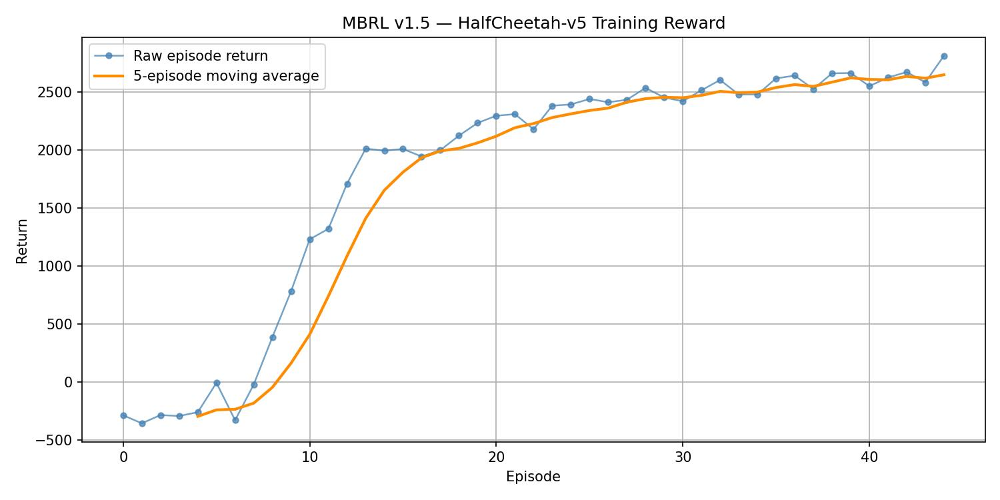
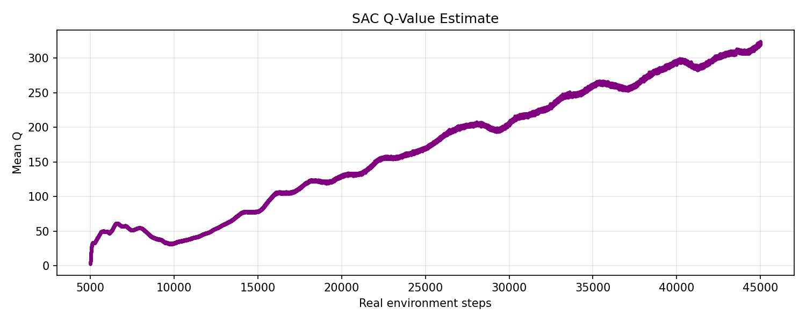

\newpage

# Environment & Problem Setting

**HalfCheetah-v5** is a MuJoCo continuous-control benchmark featuring a planar two-legged robot with six actuated joints (back thigh, back shin, back foot, front thigh, front shin, front foot). The objective is to apply joint torques so the robot runs forward as fast as possible while incurring minimal control effort.

The **state space** is 18-dimensional with `exclude_current_positions_from_observation=False`:

- Torso x-position (dimension 0, used for reward computation)
- Torso z-position (height proxy), torso pitch angle
- Joint angles and velocities for each of the six joints (12 dimensions)
- Torso translational velocities (x, z) and angular velocity

The **action space** consists of 6-dimensional continuous torques in the range $[-1, 1]^6$, with one value per joint.

**Reward structure.** The reward decomposes cleanly into two analytic terms:

$$r_t = \underbrace{\frac{x_{t+1} - x_t}{0.05}}_{\text{forward reward}} - \underbrace{0.1\,\lVert a_t \rVert_2^2}_{\text{control cost}}$$

where $x_t$ is the torso x-position and $0.05$ is the simulator time step. Because the reward depends only on consecutive x-positions and the action, it can be reconstructed analytically from $(s_t, a_t, s_{t+1})$ without a separate learned reward model, a property we exploit in Task 1.

**Why model-based RL here?** HalfCheetah has smooth, near-Gaussian one-step dynamics with no contact discontinuities as severe as bipedal walking, making it a good testbed for a learned dynamics model. MBRL methods can exploit imagined rollouts to improve policy quality with far fewer real interactions than purely model-free RL, which is practically important for real-world robotics where environment interaction is costly.

\newpage

# Task 1: Model-Based RL v1.5 (CEM-MPC)

## Method Overview

The Task 1 implementation follows the **MBRL v1.5** recipe: an iterative data-aggregation loop that alternates between (a) training a neural dynamics model on all collected data and (b) collecting new real-environment data using a model-predictive controller (MPC) powered by that model. There is no explicit policy network; at every environment step the action is computed fresh by solving a short-horizon planning problem inside the learned model.

This is closely related to the MBRL-as-DAgger view: each MPC step contributes a new transition to an ever-growing replay buffer, so the model is trained on the union of all historical on-policy data rather than only the most recent trajectory.

The MPC objective includes a small amount of heuristic shaping only to stabilize action selection during planning. This does not change the algorithm's model-based nature: the controller still learns dynamics from real environment transitions and uses that learned model to plan actions. Reported returns are always the true HalfCheetah environment returns, not the shaped planning score.

## Data Collection from the Real Environment

Data collection proceeds in two phases.

**Phase 0: Random Initialization.** Before any model exists, 5 000 transitions are collected using uniformly random actions (`env.action_space.sample()`). This provides an initial diverse dataset that covers the state space around the resting posture and ensures the first model training step is not under-determined.

**Outer MBRL loop.** For each of 40 outer iterations, the MPC controller, driven by the current learned model, collects exactly 1 000 real environment steps. All transitions are appended to a single replay buffer (capacity 600 000, never wraps with 45 000 total transitions). Because the buffer accumulates data from every iteration, the model at iteration $k$ is trained on all $5000 + k \times 1000$ transitions seen so far. This data-aggregation strategy ensures the model generalizes to the states the planner actually visits, progressively closing the distribution shift between the model's training data and its rollout data.

**Total real-environment steps:** $5000 + 40 \times 1000 = \mathbf{45\,000}$.

## Dynamics Model

The dynamics model is a **deterministic, single-member MLP** predicting the normalized one-step state delta:

$$\hat{s}_{t+1} = s_t + \delta_{\text{unnorm}}\!\left(f_\theta\!\left(\bar{s}_t, a_t\right)\right)$$

where $\bar{s}_t$ denotes the normalized observation and $\delta_{\text{unnorm}}$ reverses the delta normalizer. The architecture is:

$$\text{FC}(24 \to 256) \xrightarrow{\text{SiLU}} \text{FC}(256 \to 256) \xrightarrow{\text{SiLU}} \text{FC}(256 \to 256) \xrightarrow{\text{SiLU}} \text{FC}(256 \to 18)$$

SiLU (Swish) activation is used because it is smooth and avoids the dying-neuron problem of ReLU, which is important for a regression model operating on a continuous state space.

**No reward head.** Instead, the reward at each imagined step is reconstructed analytically from $(s_t, a_t, \hat{s}_{t+1})$ using the HalfCheetah reward formula above. This sidesteps the need to fit a separate reward model and eliminates one source of compounding prediction error in imagined rollouts.

**Input/output normalization.** Two `Normalizer` objects (one for observations, one for state deltas) maintain per-dimension mean and standard deviation. They are refitted on the current training split at the start of every model-training call, ensuring the model always operates in a well-scaled space regardless of how the data distribution shifts across iterations.

## Model Training

The model is trained at the start of each outer iteration (before collecting new data) on the full replay buffer. Key details:

- **Loss:** MSE in the **normalized delta space**, $\mathcal{L} = \frac{1}{B}\sum_b \bigl\lVert f_\theta(\bar{s}_b, a_b) - \bar{\delta}_b \bigr\rVert_2^2$.
- **Optimizer:** Adam with $\text{lr} = 3 \times 10^{-4}$, weight decay $10^{-5}$.
- **Epochs per iteration:** 40 (Adam's running moments are **not** reset between outer iterations, so training is continuous across the full 40-iteration run).
- **Train/validation split:** 90 % / 10 %, reshuffled each call.
- **Gradient clipping:** global $\ell_2$ norm capped at 1.0.
- **Validation metric:** MSE in the **original (un-normalized) delta space**, giving a physically interpretable 1-step prediction error.
- **No early stopping** is applied; 40 epochs run unconditionally to ensure the model has enough capacity to absorb new data each iteration.

After the final (40th) iteration, one additional model-training pass is performed on the complete 45 000-transition buffer ("final retrain").

## Planning: Cross-Entropy Method MPC

At each real environment step, the action is produced by solving a $H$-step planning problem inside the learned model using the **Cross-Entropy Method (CEM)**:

$$a_0^* = \arg\max_{a_{0:H-1}} \sum_{h=0}^{H-1} J(s_h, a_h, s_{h+1}), \quad s_{h+1} = s_h + \delta_\text{unnorm}(f_\theta(\bar{s}_h, a_h))$$

where $J$ is a **shaped planning objective**. Rather than optimizing the raw HalfCheetah reward, the planner minimizes a surrogate that adds uprightness penalties:

$$J = r_{\text{HalfCheetah}}(s, a, s') - \lambda_\theta \tilde\theta^2 - \lambda_z\,\text{ReLU}(z_{\min} - s'_z)^2 - \lambda_{\dot\theta}\dot\theta^2 - \mathbb{1}[\text{fall}] \cdot P_{\text{fall}}$$

where $\tilde\theta$ is the torso pitch angle (wrapped to $[-\pi, \pi]$), $s'_z$ is the torso height, $\dot\theta$ is the angular velocity, and the hard-fall indicator fires when $|\tilde\theta| > 1.2$ rad or $s'_z < -0.35$. These terms are planning heuristics for the CEM optimizer: they discourage unstable imagined motions when selecting actions, but they are not used as the training or evaluation return.

**CEM procedure.** The distribution over $H$-step action sequences is maintained as an independent Gaussian per time step and action dimension, initialized to the action-box midpoint with $\sigma = \frac{\text{high} - \text{low}}{2}$ (no warm-start across env steps):

1. Sample $K = 500$ candidate sequences $\{(a_{0:H-1})^{(k)}\}_{k=1}^K$ from the current distribution, clipped to $[-1, 1]^6$.
2. Roll all $K$ sequences forward in the model in a single batched GPU pass and accumulate the summed $J$.
3. Select the top $E = 50$ (10 %) by cumulative $J$; refit mean and std from the elites, clamping $\sigma \geq 0.05$.
4. Repeat for $I = 3$ CEM iterations.
5. Execute $\text{mean}[0]$ (the first action of the refined elite mean) in the real environment.

The planner is **replanned at every single step**; there is no receding-horizon warm-start that reuses the previous step's solution. While warm-starting can speed up convergence, the fresh initialization avoids committing to a stale distribution when the dynamics model is still inaccurate in the early iterations.

## Hyperparameters

| Parameter                             | Value                                  |
| :------------------------------------ | :------------------------------------- |
| Environment                           | HalfCheetah-v5 (obs dim 18, act dim 6) |
| Random init steps                     | 5 000                                  |
| Outer iterations                      | 40                                     |
| Steps per iteration                   | 1 000                                  |
| Total real env steps                  | 45 000                                 |
| Replay buffer capacity                | 600 000                                |
| Model hidden width                    | 256                                    |
| Model hidden layers                   | 3                                      |
| Model activation                      | SiLU                                   |
| Model optimizer / lr                  | Adam / $3 \times 10^{-4}$              |
| Model weight decay                    | $10^{-5}$                              |
| Model batch size                      | 256                                    |
| Model epochs per iteration            | 40                                     |
| Validation fraction                   | 0.10                                   |
| Gradient clip ($\ell_2$)              | 1.0                                    |
| MPC horizon $H$                       | 15                                     |
| CEM candidates $K$                    | 500                                    |
| CEM iterations $I$                    | 3                                      |
| CEM elites $E$                        | 50                                     |
| CEM init std                          | $(h - l) / 2$                          |
| CEM min std                           | 0.05                                   |
| Torso-angle weight $\lambda_\theta$   | 3.0                                    |
| Torso-height weight $\lambda_z$       | 10.0                                   |
| Ang-vel weight $\lambda_{\dot\theta}$ | 0.05                                   |
| Fall angle threshold                  | 1.2 rad                                |
| Fall height threshold                 | $-0.35$                                |
| Fall penalty $P_{\text{fall}}$        | 5.0                                    |
| Checkpoint eval interval              | every 5 iterations                     |
| Final eval episodes                   | 10 (deterministic)                     |
| Random seed                           | 42                                     |

Table: Task 1 hyperparameters.

## Training Results



The learning curve follows a characteristic MBRL pattern. During random initialization, the agent often makes little forward progress while still paying control cost, producing negative returns. There is no explicit fall penalty in HalfCheetah; the poor return comes mainly from low forward velocity and accumulated control cost. After the first model training + MPC iteration, the return rises to $-6.6$, meaning the planner can already find action sequences that keep the cheetah balanced. By iteration 4 (8 000 real steps) the return crosses zero and reaches $+388.3$; by iteration 6 it exceeds 1 000.

From iterations 8–40 the return climbs steadily from $\sim$ 1 700 to $\sim$ 2 800 with only minor oscillations. The steady improvement reflects the data-aggregation mechanism: each new iteration adds 1 000 transitions in the region the planner actually visits, giving the model progressively better coverage of the on-policy state distribution and reducing the value of the shaped objective overestimates that previously misled the CEM.

All Task 1 training, checkpoint, and final evaluation scores reported here are measured by executing actions in the real HalfCheetah environment and summing the environment's reward. They are not the shaped MPC planning objective used internally by CEM.

```{=latex}
\begin{figure}[H]
\centering
\includegraphics[width=\linewidth,height=0.25\textheight,keepaspectratio]{task1/plots/model_train_loss.jpg}
\caption{Task 1 dynamics model training loss (normalised delta space) vs.\ epoch across all 40 outer iterations (1\,600 total epochs). The sharp drop in the first $\sim$40 epochs reflects initial model convergence; the long tail captures incremental refinement as new on-policy data is added each iteration.}
\end{figure}
\vspace{-6pt}
\begin{figure}[H]
\centering
\includegraphics[width=\linewidth,height=0.25\textheight,keepaspectratio]{task1/plots/model_val_loss.jpg}
\caption{Task 1 dynamics model validation MSE (original-space delta) vs.\ outer iteration. One value is recorded per iteration after model training completes on the current replay buffer.}
\end{figure}
\vspace{-6pt}
\begin{figure}[H]
\centering
\includegraphics[width=\linewidth,height=0.25\textheight,keepaspectratio]{task1/plots/rollout_pred_error.jpg}
\caption{Task 1 MPC rollout real-vs-predicted 1-step MSE (environment space) vs.\ outer iteration. The spike at iteration 2 occurs because the freshly trained model encounters states outside its training distribution; subsequent iterations resolve the mismatch.}
\end{figure}
```

The model training loss (normalized space) decreases monotonically from 0.0595 at iteration 1 to 0.0033 at iteration 40, an 18-fold reduction. The validation MSE in original delta space falls from 0.891 to 0.056 (16-fold). The 1-step MPC rollout error starts at 1.10, spikes to 2.17 at iteration 2 as the planner enters previously unseen states, then drops rapidly to below 0.25 by iteration 5 and continues declining to 0.05 by iteration 40. The close agreement between val MSE and rollout error from iteration 5 onward indicates that the holdout set and the MPC-visited state distribution are well aligned, confirming that the data-aggregation loop is working as intended.

## Evaluation

Checkpoint evaluations (3 deterministic episodes, seeds 3042–3044) are run every 5 outer iterations; the model giving the highest checkpoint-eval mean is saved to `best_agent.pth`. Results:

| Outer iteration | Real env steps | Checkpoint eval mean $\pm$ std |
| --------------: | -------------: | :----------------------------- |
|               5 |         10 000 | $819.2 \pm 19.6$               |
|              10 |         15 000 | $1989.4 \pm 24.7$              |
|              15 |         20 000 | $2159.2 \pm 5.0$               |
|              20 |         25 000 | $2354.2 \pm 2.1$               |
|              25 |         30 000 | $2479.2 \pm 13.1$              |
|              30 |         35 000 | $2479.6 \pm 47.4$              |
|              35 |         40 000 | $2676.4 \pm 10.3$              |
|          **40** |     **45 000** | $\mathbf{2751.5 \pm 18.3}$     |
|   Final retrain |         45 000 | $2630.5 \pm 24.7$              |

Table: Task 1 checkpoint evaluation results. Best checkpoint (iter 40) is used for the final evaluation.

The iteration-40 checkpoint, not the post-final-retrain checkpoint, is the peak performer. The final retrain actually slightly degraded the eval mean (2630.5 vs 2751.5), likely because retraining on the full buffer without resetting the Adam optimizer perturbs the already-converged weight space. The best-checkpoint mechanism correctly captures the iter-40 weights.

**Final 10-episode deterministic evaluation** (best checkpoint, seeds 1042–1051):

| Metric        | Value           |
| :------------ | :-------------- |
| Mean reward   | **2762.36**     |
| Std deviation | 33.49           |
| Min / Max     | 2669.4 / 2793.1 |

Table: Task 1 final 10-episode evaluation (deterministic rollouts, best checkpoint).

Wall-clock training time: **36 min 38 s** on one A800 GPU (45 000 real env steps, 40 outer iterations).

\newpage

# Task 2: MBPO (Probabilistic Ensemble + SAC)

## Method Overview

Task 2 implements **MBPO** (Model-Based Policy Optimization, Janner et al. 2019), which replaces the planning-based action selection of Task 1 with a **learned policy** trained by a model-free RL algorithm (SAC) on a mixture of real and synthetic data. The key insight is that short (k-step) model rollouts branched from real-data states provide high-quality additional training signal for the critic and actor, dramatically improving sample efficiency relative to model-free SAC alone, without relying on long imagined trajectories where model errors accumulate.

The implementation matches the paper's HalfCheetah configuration (ensemble size B=7, elite size 5, rollout length k=1, gradient-steps-per-env-step G=40, real-data fraction 5 %, rollout batch M=400), with the only intentional deviation being a reduced real-environment budget of 45 000 steps (vs. 400 000 in the paper) to allow a fair comparison with Task 1 under the same interaction constraint. The choice $k=1$ is intentional: MBPO is designed around short branched rollouts from replay-buffer states, and the paper's HalfCheetah hyperparameter table uses a one-step model horizon.

## Replay Buffers

Two separate replay buffers are maintained, as in the original MBPO paper.

**Real-environment buffer** $\mathcal{D}_{\text{env}}$ (capacity 67 500 = $1.5 \times 45\,000$): stores all transitions $(s, a, s', r, d)$ collected from the real environment. The done flag is set to `float(terminated)` only; time-limit truncations do **not** set done, so the value target for truncated episodes still bootstraps from $V(s')$ rather than zeroing it out. This is the correct treatment for environments with an artificial time limit and is important for unbiased Q-function learning in HalfCheetah, where episodes almost never truly terminate.

**Synthetic (model) buffer** $\mathcal{D}_{\text{model}}$ (capacity 400 000): stores transitions generated by rolling out the ensemble inside imagined trajectories. It is **cleared** every time the ensemble is retrained (every 1 000 real steps) and refilled by 400 one-step rollouts per real env step in between, so at any retrain boundary it contains exactly $400 \times 1 \times 1000 = 400\,000$ fresh synthetic transitions (filling its capacity). Clearing on retrain avoids mixing data from qualitatively different model versions.

## Probabilistic Dynamics Ensemble

The dynamics model is a **probabilistic ensemble** of 7 members following the PETS architecture (Chua et al. 2018).

**Architecture.** Each member is an MLP:

$$\text{FC}(24 \to 200) \xrightarrow{\text{SiLU}} \text{FC}(200 \to 200) \xrightarrow{\text{SiLU}} \text{FC}(200 \to 200) \xrightarrow{\text{SiLU}} \text{FC}(200 \to 200) \xrightarrow{\text{SiLU}} \text{FC}(200 \to 38)$$

The 38-dimensional output gives $(\mu, \log\hat\sigma^2)$ for the concatenated target vector $y = [\Delta s,\, r] \in \mathbb{R}^{19}$, so the ensemble **jointly predicts state deltas and rewards** (unlike Task 1 which uses an analytic reward).

**Bounded log-variance.** Raw logvar outputs are soft-clamped via learnable scalars $v_{\max}$ (init 0.5) and $v_{\min}$ (init $-10$):

$$\log\sigma^2 = v_{\max} - \text{softplus}(v_{\max} - \hat{v}) ;\quad \log\sigma^2 = v_{\min} + \text{softplus}(\log\sigma^2 - v_{\min})$$

This prevents variance collapse (which would make the NLL loss meaningless) and variance explosion (which would swamp the mean gradient).

**Input normalization.** Per-dimension mean/std of the input $[s, a]$ is recomputed from $\mathcal{D}_{\text{env}}$ at each retrain; targets $y$ are not normalized (the predicted variance absorbs scale differences).

**Per-member bootstrap.** Each member is trained on a bootstrap resample (with replacement) of the training indices, giving the ensemble epistemic diversity without explicitly sharing gradients, which is the key mechanism that makes the ensemble's disagreement a meaningful uncertainty proxy.

**Elite selection.** After each retrain, the 5 members with the lowest holdout MSE are designated as "elites." Synthetic rollouts sample a random elite member at each transition step, ensuring that both low-variance and exploratory model predictions contribute to $\mathcal{D}_{\text{model}}$.

## Ensemble Training

**Loss.** Each member minimizes the Gaussian NLL plus a regularizer on the learnable logvar bounds:

$$\mathcal{L}_{\text{NLL}} = \frac{1}{B}\sum_b \frac{1}{2}\left[\frac{(\mu_b - y_b)^2}{\sigma_b^2} + \log\sigma_b^2\right] + 0.01\,(v_{\max}\mathbf{1} - v_{\min}\mathbf{1})^\top\mathbf{1}$$

The logvar regularizer penalizes the range $[v_{\min}, v_{\max}]$ from becoming unnecessarily wide.

**Schedule.** The ensemble is retrained every 1 000 real env steps, plus once immediately after the 5 000-step random warmup. Early stopping with patience 5 and up to 80 epochs per retrain; in practice most retrains after 15 000 steps stop at 6 epochs (patience reached quickly with the small incremental data).

**Optimizer:** Adam with $\text{lr} = 10^{-3}$, weight decay $10^{-5}$, gradient clip $\ell_2$ norm 100.

## Synthetic Rollout Generation

At every real env step, $M = 400$ starting states are sampled uniformly from $\mathcal{D}_{\text{env}}$ and rolled forward for $k = 1$ step using a randomly drawn elite member:

$$s' = s + \mu_i(s, \pi(s)) + \varepsilon, \quad \varepsilon \sim \mathcal{N}(0, \sigma_i^2(s, \pi(s))), \quad i \sim \text{Uniform}(\text{elites})$$

where $\pi$ is the **current SAC actor** (stochastic). Using the actor (rather than a random policy) to generate synthetic data ensures that $\mathcal{D}_{\text{model}}$ reflects the states the current policy is likely to visit, keeping the value estimates on-distribution. The done flag for synthetic transitions is always 0 because the ensemble does not predict termination.

With $k = 1$ fixed, synthetic rollouts avoid multi-step compounding model error, though one-step model error remains. For HalfCheetah, this is a defensible trade-off: the model still supplies many synthetic transitions for SAC updates, while keeping critic targets close to real replay-buffer states.

## SAC Policy Optimizer

The policy is trained by **Soft Actor-Critic** (Haarnoja et al. 2018) with automatic entropy tuning.

**Actor.** A tanh-Gaussian stochastic policy with shared body MLP (input 18 → FC(256) → ReLU → FC(256) → ReLU) followed by separate linear heads for $\mu$ and $\log\sigma$, clamped to $[-20, 2]$. Actions are sampled as $a = \tanh(\mu + \sigma \varepsilon)$, $\varepsilon \sim \mathcal{N}(0, I)$, with the standard log-probability correction $\sum_i \log(1 - \tanh^2(u_i) + \epsilon)$.

**Critics.** Twin Q-networks $Q_1, Q_2$ (both: input $(s,a)$ → FC(256) → ReLU → FC(256) → ReLU → scalar) with separate target networks updated via Polyak averaging ($\tau = 5 \times 10^{-3}$). The critic target uses the minimum of the twin targets minus the entropy bonus: $y = r + \gamma[\min_i Q_i^{\text{tgt}}(s', \pi(s')) - \alpha \log\pi(a'|s')]$.

**Auto-tuned entropy coefficient.** $\log\alpha$ is a learnable scalar updated to minimize $\mathcal{L}_\alpha = -\log\alpha\,(\log\pi(a|s) + H_{\text{target}})$ with $H_{\text{target}} = -|\mathcal{A}| = -6$. This eliminates manual temperature tuning and lets the agent adjust its exploration level throughout training.

**Data mixture.** Each SAC gradient step draws a batch of 256 transitions: 5 % from $\mathcal{D}_{\text{env}}$ ($\approx$ 13 real transitions) and 95 % from $\mathcal{D}_{\text{model}}$ ($\approx$ 243 synthetic). This ratio is the key MBPO hyperparameter: too little real data and the critic over-fits to model errors; too much real data and we lose the sample-efficiency benefit of the synthetic buffer.

**Update frequency.** $G = 40$ SAC gradient steps are performed per real env step. Combined with $M = 400$ synthetic transitions added per step and the 95 % synthetic ratio, the effective number of SAC gradient updates across the 40 000 policy steps is $40\,000 \times 40 = 1\,600\,000$.

## Hyperparameters

| Parameter                             | Value                     |
| :------------------------------------ | :------------------------ |
| Total real env steps                  | 45 000                    |
| Random warmup steps                   | 5 000                     |
| Policy env steps                      | 40 000                    |
| $\mathcal{D}_{\text{env}}$ capacity   | 67 500                    |
| $\mathcal{D}_{\text{model}}$ capacity | 400 000                   |
| Ensemble size $B$                     | 7                         |
| Elite size                            | 5                         |
| Model hidden width                    | 200                       |
| Model hidden layers                   | 4                         |
| Model activation                      | SiLU                      |
| Model optimizer / lr                  | Adam / $10^{-3}$          |
| Model weight decay                    | $10^{-5}$                 |
| Model batch size                      | 256                       |
| Model max epochs                      | 80                        |
| Early-stopping patience               | 5                         |
| Holdout fraction                      | 0.10                      |
| Logvar regularizer                    | 0.01                      |
| Model grad clip ($\ell_2$)            | 100                       |
| Model retrain interval                | every 1 000 steps         |
| Rollout batch $M$                     | 400                       |
| Rollout length $k$                    | 1 (fixed)                 |
| SAC hidden width                      | 256                       |
| SAC hidden layers                     | 2                         |
| SAC activation                        | ReLU                      |
| SAC optimizer / lr                    | Adam / $3 \times 10^{-4}$ |
| SAC batch size                        | 256                       |
| Discount $\gamma$                     | 0.99                      |
| Target update $\tau$                  | $5 \times 10^{-3}$        |
| Entropy target $H$                    | $-6$ (= $-\lvert\mathcal{A}\rvert$) |
| Real-data ratio                       | 0.05                      |
| SAC updates per env step $G$          | 40                        |
| Checkpoint eval interval              | every 5 000 steps         |
| Final eval episodes                   | 10 (deterministic)        |
| Random seed                           | 42                        |

Table: Task 2 hyperparameters.

## Training Results


The training curve follows the characteristic MBPO warm-up pattern. During the random warmup (episodes 0–4, $\approx$ 5 000 steps) the returns hover around $-200$ to $-100$: the agent acts randomly, accumulates minimal forward velocity, and control-cost dominates. Once the SAC critic begins receiving synthetic gradient updates, the 5-episode moving average climbs sharply from $\approx -300$ at episode 0 to $\approx 1\,000$ by episode 15 (15 000 real steps), reaching $\approx 3\,500$ by episode 25. The raw per-episode return is noticeably noisier than the moving average throughout, reflecting the stochastic SAC actor and the non-stationary synthetic data distribution.

**Transient regressions** are visible at two points. Around episode 28–29, one episode drops to $\approx 900$ while the surrounding episodes remain above 4 000; the 5-episode moving average dips to $\approx 3\,500$ before recovering. A second, sharper regression occurs near episode 35–37, where a single episode returns only $\approx 1\,580$, pulling the moving average down to $\approx 4\,100$. Both events coincide with ensemble retrains that temporarily shift the target distribution of the SAC critic. In neither case does the policy truly collapse: the moving average recovers within 3–5 episodes, and the raw returns consistently resume their upward trend.

From episode 38 onward the moving average rises steeply and monotonically, reaching $\approx 5\,600$ by episode 45 (45 000 real steps). This final segment reflects the joint maturation of the probabilistic ensemble and the SAC policy: the model is now accurate enough that synthetic transitions provide near-real gradient signal, and the policy has converged to a stable high-speed locomotion strategy.


The ensemble NLL (more negative = better log-likelihood) improves from $-17.0$ at the initial 5 000-step train to $-43.75$ at the final retrain. The holdout val MSE falls from 0.946 to 0.34. Crucially, the model loss improves monotonically throughout, indicating no model overfitting despite the growing $\mathcal{D}_{\text{env}}$.

The SAC critic loss is volatile and spikes after each model retrain as $\mathcal{D}_{\text{model}}$ is refreshed with transitions from an updated model, temporarily shifting the target distribution for the Q-function. The actor loss trends downward (more negative) as the policy learns to exploit higher-valued actions. Both signals are consistent with healthy SAC training under a non-stationary data distribution.



The Q-value estimate rises steadily over the 40 000 policy steps, tracking the improvement in average return. No Q-value divergence is observed; the bounded logvar in the ensemble model and the twin-critic minimum both help prevent over-optimistic Q estimates.

## Evaluation

Checkpoint evaluations (3 deterministic episodes, seeds 3042–3044) at 5 000-step intervals:

| Real env steps | Eval mean $\pm$ std        | Min / Max           |
| -------------: | :------------------------- | :------------------ |
|         10 000 | $53.9 \pm 243.7$           | $-119.1$ / $398.5$  |
|         15 000 | $1986.7 \pm 108.4$         | $1839.3$ / $2097.1$ |
|         20 000 | $3164.4 \pm 100.4$         | $3050.5$ / $3294.9$ |
|         25 000 | $3940.3 \pm 44.2$          | $3879.6$ / $3983.5$ |
|         30 000 | $2060.6 \pm 2026.9$        | $512.8$ / $4923.9$  |
|         35 000 | $5244.4 \pm 91.9$          | $5129.2$ / $5354.2$ |
|         40 000 | $5585.8 \pm 147.8$         | $5467.9$ / $5794.2$ |
|     **45 000** | $\mathbf{5752.9 \pm 62.3}$ | $5666.0$ / $5808.8$ |

Table: Task 2 checkpoint evaluation results. Best checkpoint (45 000 steps) is used for the final evaluation.

**Final 10-episode deterministic evaluation** (best checkpoint, seeds 1042–1051):

| Metric        | Value           |
| :------------ | :-------------- |
| Mean reward   | **5740.55**     |
| Std deviation | 123.87          |
| Min / Max     | 5526.3 / 5942.7 |

Table: Task 2 final 10-episode evaluation (deterministic rollouts, best checkpoint).

Wall-clock training time: **3 h 20 min 51 s** on one A800 GPU (45 000 real env steps, 1 600 000 SAC gradient updates, 16 000 000 synthetic transitions).

\newpage

# Task 3: Comparison of MBRL v1.5 vs MBPO

## Summary Table

| Dimension                  | MBRL v1.5 (Task 1)               | MBPO (Task 2)                  |
| :------------------------- | :------------------------------- | :----------------------------- |
| Real env steps             | 45 000                           | 45 000                         |
| Final 10-ep mean return    | **2762.4 ± 33.5**                | **5740.6 ± 123.9**             |
| Peak eval return           | 2751.5 (iter 40)                 | 5752.9 (step 45k)              |
| Return at 10k steps        | $\approx$ 1 989 (checkpoint)     | 53.9                           |
| Return at 20k steps        | $\approx$ 2 354 (checkpoint)     | 3164.4                         |
| Return at 45k steps        | 2762.4                           | 5740.6                         |
| Major regression           | None (monotone)                  | 30k step dip (recovered)       |
| Wall-clock training        | $\sim$ 37 min                    | $\sim$ 3 h 21 min              |
| Policy type                | CEM-MPC (planner)                | SAC (learned policy)           |
| Dynamics model             | 1 det. MLP (256×3)               | Prob. ensemble 7 × MLP (200×4) |
| Reward modelling           | Analytic                         | Learned (part of ensemble)     |
| Total imagined transitions | $\sim$ 7 500/step × 45k = 337.5M | 400/step × 40k = 16M           |

Table: Side-by-side comparison of MBRL v1.5 and MBPO on the same 45 000-step real-env budget.

## Learning and Sample Efficiency

Both algorithms receive the same 45 000 real-environment transitions, but they extract value from them very differently.

MBRL v1.5 reaches a useful return of $\sim$ 2 000 with fewer than 15 000 real steps, before MBPO's policy has started to train meaningfully. This fast early learning is the core advantage of planning-based control: even a rough dynamics model is immediately actionable via CEM; the agent does not need to learn a Q-function to start acting well.

MBPO is slow to bootstrap. At 10 000 real steps the eval return is only 54, because the SAC critic needs to absorb a sufficient quantity of synthetic data to produce useful policy gradients. However, once the critic is warm, MBPO's improvement rate is far steeper: it passes MBRL v1.5's final return ($\sim$ 2 762) before 20 000 real steps and continues climbing to 5 753 by the end, more than double MBRL v1.5's final return.

The crossover point is around 18 000–20 000 real env steps. For tasks where the agent has very few environment interactions available (below this crossover), MBRL v1.5 is the more practical choice. For tasks where the total budget exceeds $\sim$ 20 000 steps, MBPO's policy-based approach ultimately delivers superior final performance.

## Stability

MBRL v1.5 exhibits very stable learning after the initial warm-up phase. The MPC return is monotonically increasing across outer iterations (apart from two small oscillations of $< 200$ reward), and checkpoint evals improve at every interval. This stability comes from the planner's design: the CEM resets its distribution to the prior at every step, so there is no "accumulated" policy instability; only the quality of the model matters, and the model improves monotonically as data accumulates.

MBPO has one clear instability event at 30 000 real steps (eval mean 2 061, std 2 027), where a single-episode failure dominated the 3-episode estimate. This is characteristic of SAC + non-stationary model data: the critic can temporarily develop an inaccurate value surface after a model retrain, causing the actor to select actions that are good in model-space but suboptimal in the real environment. The best-checkpoint mechanism mitigates the impact, and the policy recovers fully within 5 000 steps. Qualitatively, MBRL v1.5 is more reliable in low-budget regimes; MBPO's occasional regressions are acceptable given its larger final gain.

## Final Performance

MBPO achieves a final 10-episode mean of **5 740.6** vs MBRL v1.5's **2 762.4**, approximately a **2.1× advantage** on the same environment step budget.

The gap reflects a fundamental difference in how each method uses the learned model. MBRL v1.5 plans inside the model at every real env step, requiring the model to be useful over a 15-step horizon. Model error in the CEM rollout can translate directly into suboptimal action selection, and the shaped objective's heuristic penalties may over-constrain the planner. MBPO, by contrast, uses one-step model rollouts (k=1), which avoids multi-step compounding model error while still producing synthetic transitions for SAC. The learned SAC policy directly optimizes the true environment reward through 1.6M gradient updates on real and synthetic data.

## Computational Cost

MBRL v1.5 completes in $\sim$ 37 minutes on GPU. The dominant cost is the batched CEM rollout: $K \times H = 500 \times 15 = 7\,500$ imagined transitions per real env step, totalling $\sim$ 338 million model forward passes. Despite the large imagined sample count, each forward pass is a simple 3-layer MLP evaluation, and the GPU handles all $K$ candidates in a single batched matrix multiply, so wall-clock time per MPC query is $\sim$ 40 ms.

MBPO takes $\sim$ 3 h 21 min, roughly **5.5× longer** than MBRL v1.5. The bottleneck is the 1.6 million SAC gradient updates (40 per real step × 40 000 policy steps), each involving backpropagation through the twin critics and actor. In exchange for this compute, MBPO achieves a $\sim$ 2.1× higher final return.

The cost-benefit ratio depends on the use case. For prototyping or hardware-constrained deployment where wall-clock time matters more than policy quality, MBRL v1.5's 37-minute turnaround is compelling. For applications where the asymptotic policy quality is paramount and the compute budget allows several hours, MBPO is the clear choice.

## Design Trade-offs Summary

The two algorithms represent different points in the MBRL design space:

- **Control mechanism.** MBRL v1.5 uses planning (CEM-MPC), which requires no policy-learning infrastructure and generalizes immediately to any objective that can be evaluated on model rollouts. MBPO uses a learned policy (SAC), which requires a critic warm-up period but ultimately achieves better asymptotic performance by exploiting the full gradient signal from millions of synthetic transitions.
- **Reward modelling.** MBRL v1.5 uses an analytic reward function, which removes one source of model error and is possible here because the HalfCheetah reward formula is known. MBPO's ensemble jointly predicts dynamics and reward, making it more general (applicable even when the reward is unknown) at the cost of an additional prediction target.
- **Model architecture.** MBRL v1.5 uses a lightweight deterministic single model, while MBPO uses a 7-member probabilistic ensemble. The ensemble provides uncertainty quantification (via disagreement among members) and diversity (via bootstrap sampling), both of which reduce the risk of the policy over-exploiting model errors, but at the cost of 7× the model parameters and training time.

# Conclusion

- **MBRL v1.5** implements data-aggregation MBRL with a deterministic MLP dynamics model and CEM-MPC planner. It bootstraps quickly and achieves a final 10-episode mean return of **2762.4 ± 33.5** in 45 000 real env steps, trained in $\sim$ 37 minutes. The monotone learning curve and stable checkpoint evals demonstrate that data-aggregation effectively closes the model's distribution-shift gap across iterations.
- **MBPO** implements the full MBPO paper recipe with a probabilistic 7-member ensemble, branched k=1 synthetic rollouts, and SAC policy optimization. Despite a slow start (only 53.9 at 10k steps), it reaches **5740.6 ± 123.9** at 45 000 steps, a 2.1× gain over MBRL v1.5, at the cost of 5.5× more wall-clock time ($\sim$ 3 h 21 min).
- **Sample efficiency crossover** occurs near 18 000–20 000 real env steps: MBRL v1.5 dominates before this point; MBPO dominates thereafter.
- **MBPO's one-step rollout (k=1)** is a critical design choice at 45 000 steps: it avoids multi-step compounding model error, though one-step model error remains, while still giving SAC a large synthetic training buffer.
- **Best-checkpoint saving** proved essential for both methods: MBRL v1.5's post-final-retrain checkpoint underperformed its iter-40 best (2630 vs 2751), and MBPO's 30k-step regression was transparently isolated from the final result by the mechanism.

\newpage

# How to Run

## Prerequisites

```bash
pip install "gymnasium[mujoco]" torch matplotlib numpy "imageio[ffmpeg]"
```

## Task 1: MBRL v1.5

```bash
cd submission/task1
python Code.py
```

This will:

1. Collect 5 000 random transitions.
2. Run 40 outer iterations of (model train → CEM-MPC collect 1 000 steps).
3. Save `best_agent.pth` (best checkpoint-eval weights) and `agent.pth` (final weights).
4. Write reward curve and diagnostic plots to `plots/` and `Plot.jpg`.
5. Run a 10-episode final evaluation and record 2 video episodes to `Video.mp4`.

## Task 2: MBPO

```bash
cd submission/task2
python Code.py
```

This will:

1. Collect 5 000 random transitions and train the initial ensemble.
2. Run 40 000 policy env steps with SAC + synthetic rollouts + ensemble retraining.
3. Save `best_agent.pth` and `agent.pth`.
4. Write all plots (reward curve, model loss, actor/critic/Q-value curves, diagnostics) to `plots/` and `Plot.jpg`.
5. Run a 10-episode final evaluation and record 2 video episodes to `Video.mp4`.
